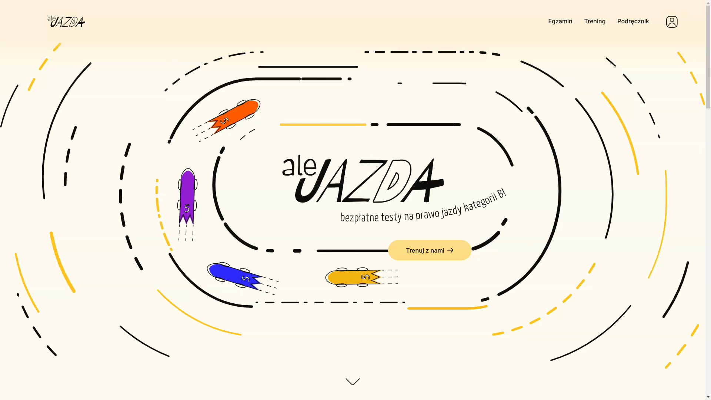
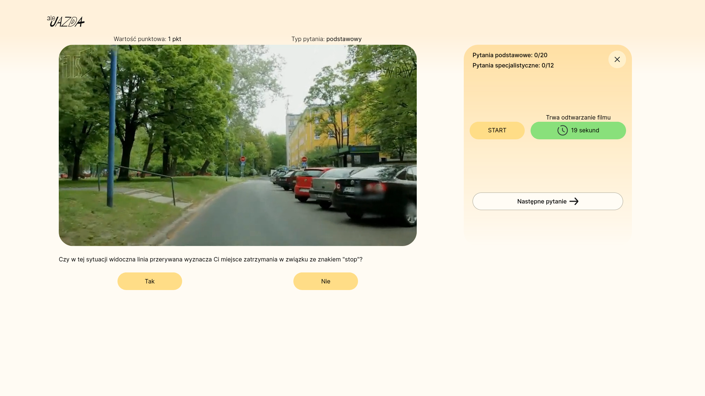
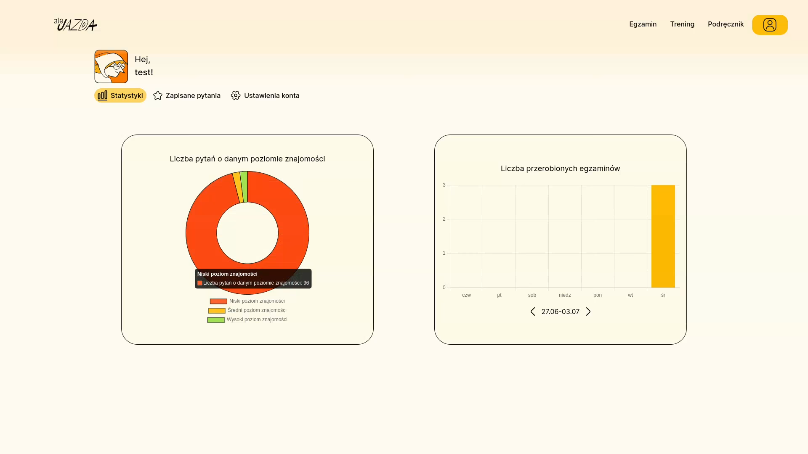
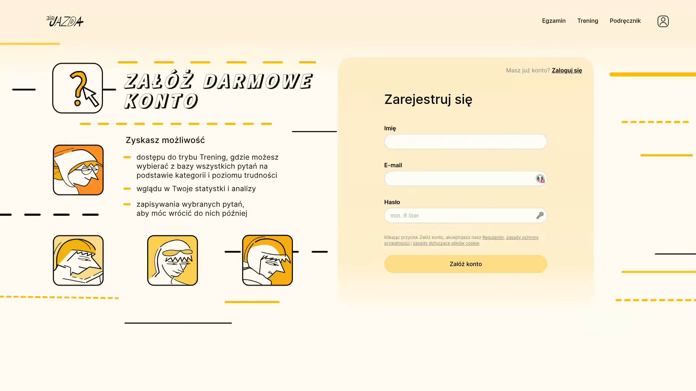
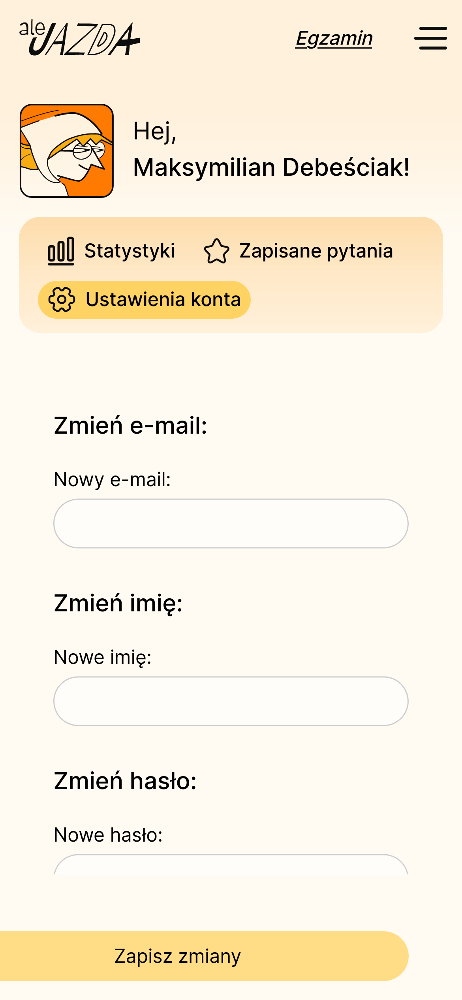
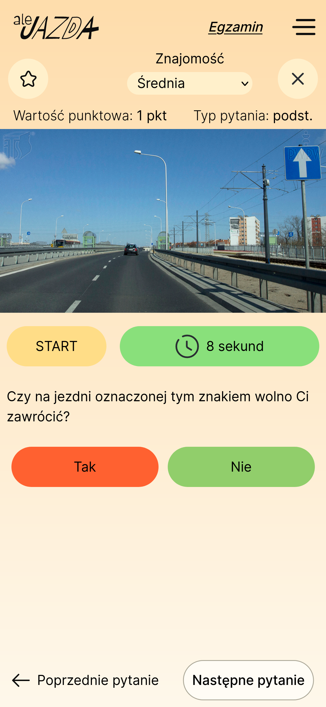

# Driving Theory Exam Prep App 🏎️



> **❗ Important Disclaimer:** While the frontend is still hosted on GitHub Pages, the backend servers on Neon are currently down. Due to this, the publicly hosted version of the application is not fully functional. You can still run the application locally by following the installation guide below, or watch the demo video for a presentation of its functionality.

## Table of Contents

* [Overview](#overview-section)
* [Demo Video](#demo-video-section)
* [Motivation](#motivation-section)
* [Key Features](#key-features-section)
* [Mobile Experience (PWA)](#mobile-experience-pwa-section)
* [Technologies Used](#technologies-used-section)
* [Installation Guide](#installation-guide-section)

<h2 id="overview-section">Overview</h2>



This project is a comprehensive full-stack web application designed to help individuals prepare for the theoretical driving license exam. It offers a modern, intuitive, and completely free alternative to existing outdated and often paid solutions. This initiative also served as the centerpiece of my B.Sc. diploma thesis at the University of Wrocław, reflecting our dedication to enhancing the user experience in educational software.

<h2 id="demo-video-section">Demo Video 🎬</h2>

Get a quick overview of the application's features and user interface by watching our demo video:

[Watch app demonstration video!](https://sztakler.github.io/portfolio/assets/videos/alejazda.webm)

<h2 id="motivation-section">Motivation ✨</h2>



The idea for this application sparked from a discussion between a friend and me about the inadequacy of current driver's license exam preparation apps. Most available options were outdated, lacked comprehensive features, and, crucially, required payment. We believed that high-quality, accessible preparation shouldn't come with a price tag. Driven by this conviction, we collaborated with a friend studying Graphic Design to create a fresh, modern, and entirely free solution for everyone.

<h2 id="key-features-section">Key Features 🔑</h2>

 
 
The application provides a robust and user-friendly experience, including:

* **Comprehensive Exam Simulations:** 🚦 Realistic simulations of the theoretical driving license exam, designed to familiarize users with the format and pressure of the actual test.
* **Diverse Learning Modes:** 📚 Multiple study modes to cater to different learning styles, allowing users to focus on specific topics or practice questions at their own pace.
* **Interactive Textbook:** 📖 A comprehensive digital textbook integrated directly into the application, providing detailed explanations and supplementary learning material.
* **User Profiles & Progress Tracking:** 📊 Personalized user accounts to track learning progress, monitor performance on quizzes and simulations, and easily revisit challenging questions.
* **Mobile-Optimized PWA:** 📱 Developed as a Progressive Web App (PWA) with a separate, optimized design for seamless and responsive experience on various mobile devices.
* **Multimedia Integration:** 🖼️ Display of multimedia content within questions to enhance understanding and engagement.
* **Robust User Authentication:** 🔐 Secure user authentication with hashed and salted passwords, utilizing Passport.js for enhanced security.
* **Layered Backend Architecture:** 🏗️ A thoughtfully designed, layered backend built with Express.js ensuring scalability, maintainability, clarity, and clear separation of concerns.
* **Dynamic Data Management:** 🗄️ Efficient management of dynamic question/answer databases and user-specific data.
* **Cross-platform Deployment:** 🚀 Successfully deployed and maintained on multiple hosting platforms (GitHub Pages for frontend, Neon for backend) ensuring high availability.

<h2 id="mobile-experience-pwa-section">Mobile Experience (PWA) 📱</h2>

  


Beyond its desktop functionality, the application is also designed as a Progressive Web App (PWA), offering a seamless and responsive experience on mobile devices. It features a separate, optimized design tailored specifically for smaller screens, ensuring excellent usability and accessibility on the go. Users can add it to their home screen for quick access, enjoying an app-like experience without needing to download from an app store.


<h2 id="technologies-used-section">Technologies Used 🛠️</h2>

* **Frontend:** React
* **Backend:** Express.js
* **Database:** PostgreSQL
* **Authentication:** Passport.js
* **Deployment:** GitHub Pages, Neon

<h2 id="installation-guide-section">Installation Guide 💻</h2>

To get the application up and running on your local machine, follow these steps:

1.  **Backend Configuration:** ⚙️
    * Navigate to the backend database configuration directory: `src/server/files/DatabaseConfiguration`
    * Open and fill in the `database.js` file with appropriate values. Please contact us privately to obtain these credentials.

2.  **Backend Setup:** 🚀
    * Open a new terminal window.
    * Navigate to the server directory: `src/server`
    * Install the necessary backend dependencies:
        ```bash
        npm install
        ```
    * Start the backend development server:
        ```bash
        npm run dev
        ```

3.  **Frontend Setup:** 🌐
    * Open another terminal window.
    * Navigate to the client directory: `src/client`
    * Install the frontend dependencies, including legacy peer dependencies to avoid potential conflicts:
        ```bash
        npm install --legacy-peer-deps
        ```
    * Start the frontend development server:
        ```bash
        npm start
        ```

Once both the backend and frontend servers are running, the application will be accessible in your web browser at: `http://localhost:3000/driver-license-uwr`

Should you encounter any issues during the setup or operation of the application, please do not hesitate to contact us. 📧
